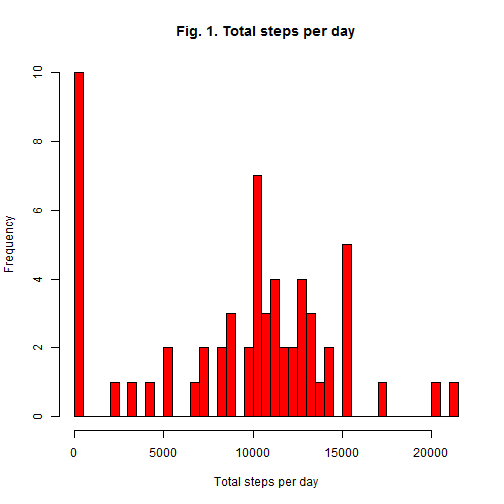
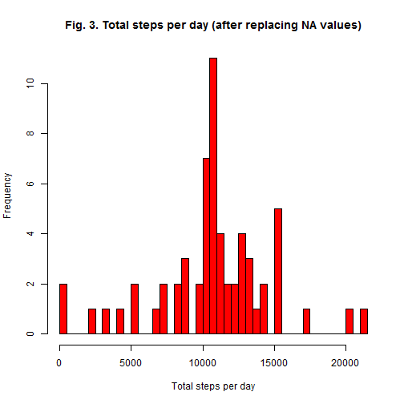
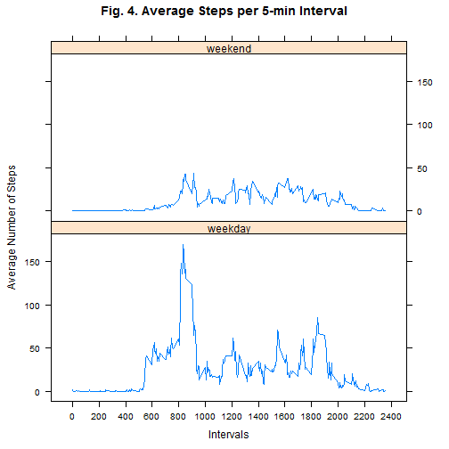

# Reproducible Research: Peer Assessment 1


## Loading and preprocessing the data  
Here's the R-code for loading and preprocessing the data:  

```r
act <- read.csv("activity.csv")
actint <- act$interval
actdate <- act$date
actsteps <- as.integer(act$steps)
library(data.table)
actt <- data.table(act)
```


## What is mean total number of steps taken per day?  
Here's the R-code for computing and plotting the mean total number of steps taken per day:  

```r
sumv <- actt[, as.double(sum(steps, na.rm = TRUE)), by = date]
sumv1 <- sumv[[1]]
sumv2 <- sumv[[2]]
meansum <- mean(sumv2)
mediansum <- median(sumv2)
hist(sumv2, breaks = length(sumv2), col = "red", main = "Fig. 1. Total steps per day", 
    xlab = "Total steps per day")
```

 

### The *mean* and *median* of total number of steps taken per day are *9354.2295* and *1.0395 &times; 10<sup>4</sup>* respectively.

## What is the average daily activity pattern?  
Here's the R-code for computing and plotting the mean total number of steps taken per 5-min interval across all days:  

```r

avgint <- actt[, as.double(mean(steps, na.rm = TRUE)), by = interval]
avgint1 <- avgint[[1]]
avgint2 <- avgint[[2]]
plot(avgint1, avgint2, type = "l", main = "Fig. 2. Average Steps per 5-min Interval", 
    xlab = "Intervals", ylab = "Average Number of Steps")
```

 

```r
maxstepsint <- avgint1[which.max(avgint2)]
```

### On average across all the days in the dataset, *the 5-minute interval = 835* contains the maximum number of steps.

## Inputing missing values  
Here's the R-code for replacing missing data with the mean for the corresponding 5-minute interval:    

```r
actna <- as.numeric(is.na(actsteps))
avgint2r <- rep(avgint2, times = length(sumv2))
actstepsn <- rowSums(cbind(actsteps, actna * avgint2r), na.rm = TRUE)
missingvalrowcnt <- sum(actna)
```

### The total number of missing values in the dataset (i.e. the total number of rows with NAs) is 2304.

## What is new  mean total number of steps taken per day?
Here's the R-code for computing and plotting the New mean total number of steps taken per day:

```r
actnewt <- data.table(date = actdate, interval = actint, steps = actstepsn)

sumnewv <- actnewt[, as.double(sum(steps, na.rm = TRUE)), by = date]
sumnewv1 <- sumnewv[[1]]
sumnewv2 <- sumnewv[[2]]
meansumnew <- mean(sumnewv2)
mediansumnew <- median(sumnewv2)
hist(sumnewv2, breaks = length(sumnewv2), col = "red", main = "Fig. 3. Total steps per day (after replacing NA values)", 
    xlab = "Total steps per day")
```

 

### The NEW *mean* and *median* of total number of steps taken per day are *1.0766 &times; 10<sup>4</sup>* and *1.0766 &times; 10<sup>4</sup>* respectively.

### The impact of replacing missing data with the mean for the corresponding 5-minute interval, on the estimates of the total daily number of steps is as follows:
**1.  The new Mean is equal to the new Median of the total number of steps taken per day whereas the old Mean is NOT equal to the old Median.**  
**2.	The new Mean and Median are greater than the old ones.**

## Are there differences in activity patterns between weekdays and weekends?  
Here's the R-code for computing (using the NEW data) and plotting the number of steps taken per 5-min interval, averaged across all weekday days or weekend days:  

```r
wday <- weekdays(strptime(actdate, "%Y-%m-%d"))
wd <- rep("weekday", times = length(avgint1))
we <- rep("weekend", times = length(avgint1))
wdayint <- c(wd, we)
actinttmsw <- c(avgint1, avgint1)

wdc <- as.numeric(!(wday == "Saturday") & !(wday == "Sunday"))
wec <- as.numeric((wday == "Saturday") | (wday == "Sunday"))
actnewtwd <- data.table(date = actdate, interval = actint, steps = actstepsn * 
    wdc)
actnewtwe <- data.table(date = actdate, interval = actint, steps = actstepsn * 
    wec)
avgintwd <- actnewtwd[, as.double(mean(steps, na.rm = TRUE)), by = interval]
avgintwe <- actnewtwe[, as.double(mean(steps, na.rm = TRUE)), by = interval]
avgintn <- c(avgintwd[[2]], avgintwe[[2]])
maxstepsintn <- actinttmsw[which.max(avgintn)]

weekint <- data.frame(interval = actinttmsw, f = factor(wdayint), avgSteps = avgintn)
library(lattice)
p <- xyplot(avgSteps ~ interval | f, data = weekint, type = "l", layout = c(1, 
    2), scales = list(x = list(tick.number = 10)), xlab = "Intervals", ylab = "Average Number of Steps", 
    main = "Fig. 4. Average Steps per 5-min Interval")  ## plot w 2 panels
print(p)
```

 

### On average across all the days in the NEW dataset, *the 5-minute interval = 835* contains the maximum number of steps.  
### The average number of steps per 5-minute interval on weekdays seem to be greater than those on weekends.
The End
